# 🤖 AI Research Paper Recommendation System

> An intelligent web-based system for personalized academic research paper discovery and recommendation.

---

## 📌 Project Overview

The **AI Research Paper Recommendation System** is a web-based software system designed to help students, researchers, and faculty members discover relevant academic research papers efficiently.

With thousands of research papers being published across different domains, finding the right papers using traditional keyword-based search can be time-consuming. This system aims to provide **personalized research paper recommendations** by analyzing:

* User research interests
* Paper titles and abstracts
* Keywords
* Search history
* Bookmarked papers
* User feedback
* Paper metadata

The system combines **Natural Language Processing (NLP)** and **Machine Learning (ML)** techniques with external academic APIs to generate relevant recommendations.

---

# 🎯 Problem Statement

Researchers and students often have to search through a large number of academic papers to find useful research material.

Traditional search systems mainly depend on keywords and may return:

* Too many irrelevant papers
* Broad search results
* Repetitive papers
* Papers unrelated to the user's research interests
* Difficulty in discovering related research

Therefore, there is a need for an intelligent system that can understand user interests and recommend relevant research papers automatically.

---

# 💡 Proposed Solution

The proposed system provides a personalized platform where users can:

1. Register/Login
2. Create a research profile
3. Specify research interests
4. Search for research papers
5. View personalized recommendations
6. Bookmark useful papers
7. Provide feedback
8. Export citations

The recommendation engine processes paper information using NLP/ML techniques and uses user interaction data to improve future recommendations.

---

# 🎯 Objectives

The main objectives of the project are:

* To develop a web-based research paper recommendation system.
* To reduce the time required to find relevant research papers.
* To provide personalized paper recommendations.
* To analyze research paper content using NLP techniques.
* To integrate academic paper APIs.
* To maintain user preferences and reading history.
* To improve recommendations using user feedback.
* To provide search, bookmark, and citation export functionality.
* To demonstrate the application of Software Engineering principles in a real-world project.

---

# 🌟 Key Features

### 👤 User Management

* User registration
* User login
* User profile management
* Research interest selection

### 🔍 Paper Search

Search papers using:

* Title
* Author
* Keywords
* Research domain

### 🤖 AI Recommendation Engine

The recommendation engine can use:

* TF-IDF
* Cosine Similarity
* Word Embeddings
* NLP preprocessing
* Content-Based Filtering
* Collaborative Filtering

### 📚 Paper Management

Users can:

* View papers
* Bookmark papers
* Save papers
* View recommendation history
* Export citations

### 👍 Feedback System

Users can provide feedback such as:

* Like
* Dislike
* Save/Bookmark

This information can be used to improve the user's recommendation profile.

### 🌐 External API Integration

The system can retrieve academic paper metadata from:

* arXiv
* Semantic Scholar
* CrossRef

---

# 🏗️ System Architecture

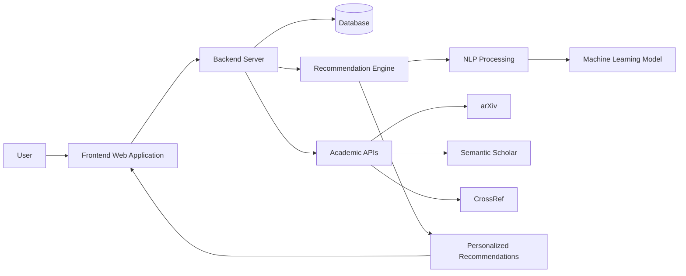

---

# 🔄 System Flowchart

The basic working flow of the system is:

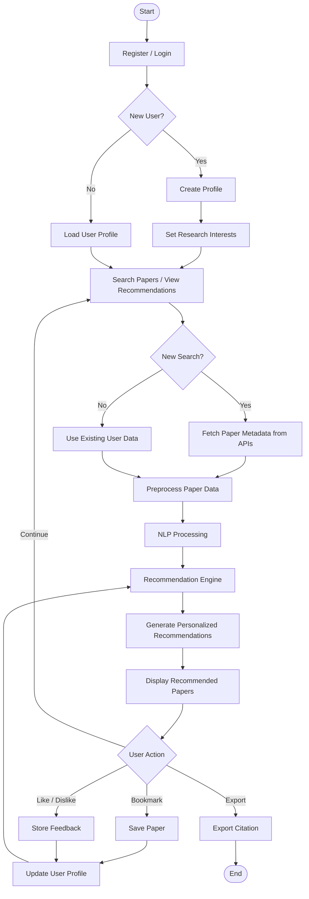

---

# 🧠 Recommendation System Workflow

The recommendation process consists of the following major stages:

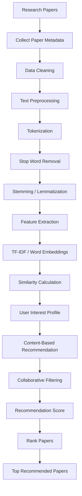

---

# 👥 Actors

The major actors in the system are:

| Actor                      | Responsibility                                             |
| -------------------------- | ---------------------------------------------------------- |
| **User**                   | Searches, views, bookmarks and provides feedback on papers |
| **Admin**                  | Manages users and system data                              |
| **External Academic APIs** | Provide research paper metadata                            |

---

# 📊 Use Case Diagram

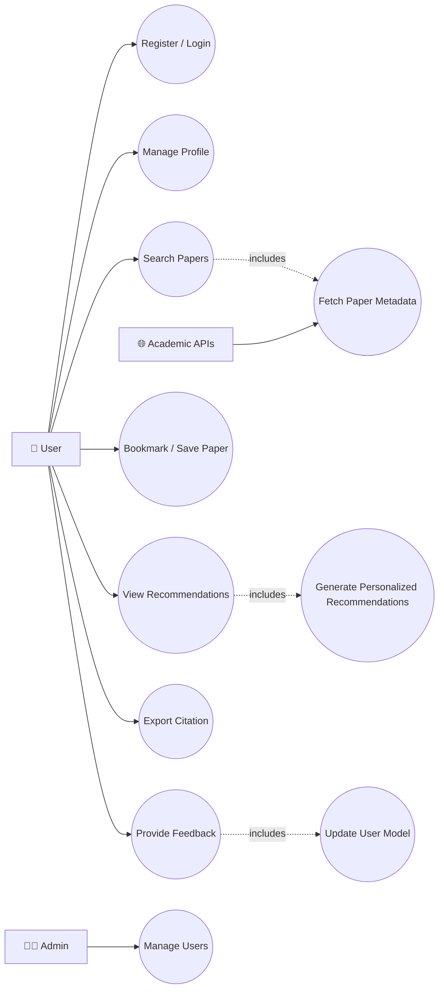

---

# 🏛️ Class Diagram

The major classes/entities of the system can be represented as:

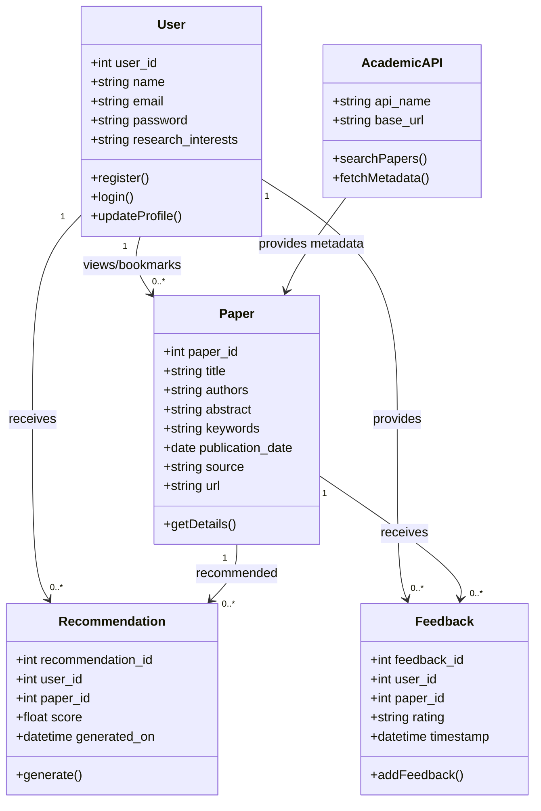

---

# 🔢 Sequence Diagram

The recommendation process can be represented using the following sequence:

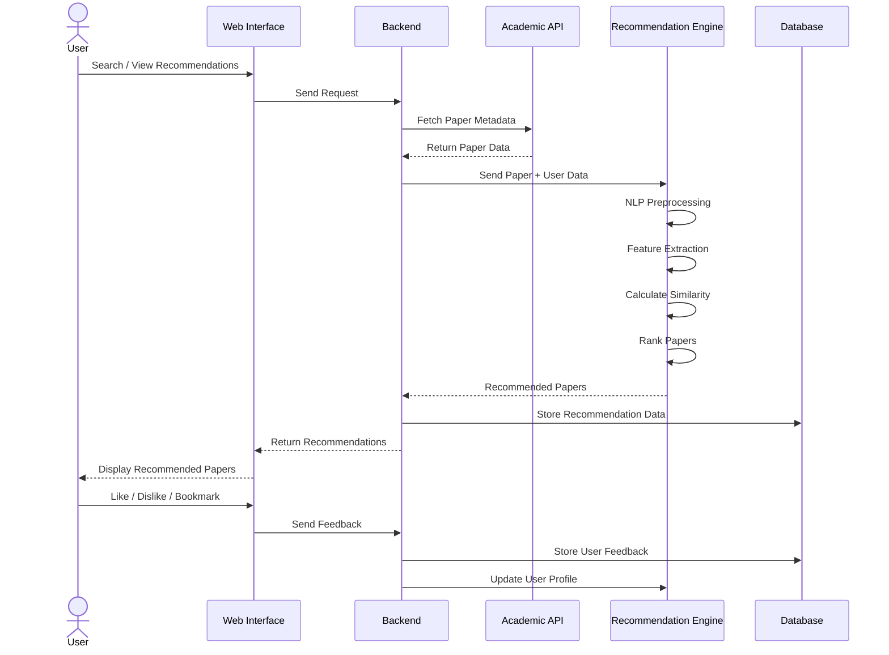

---

# 🔄 Activity Diagram

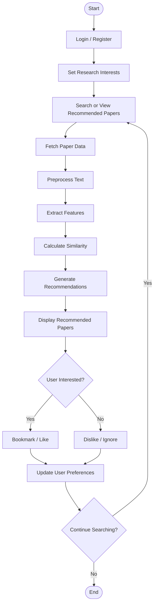

---

# 🗄️ Database / ER Diagram

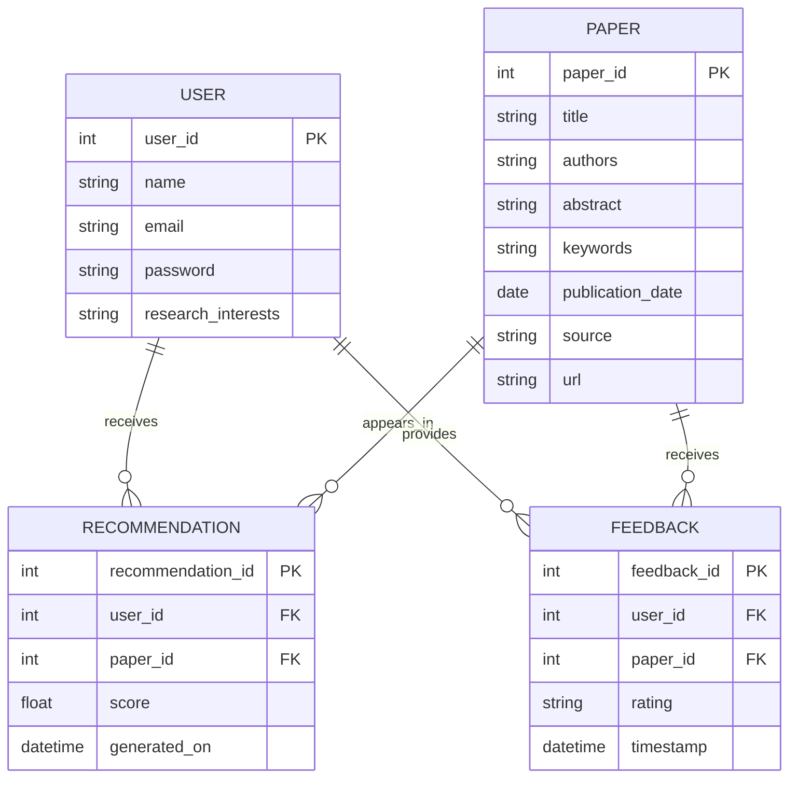

---

# 📱 Functional Requirements

## FR1 – User Registration

The system shall allow new users to create an account using basic information such as name, email and password.

## FR2 – User Authentication

The system shall authenticate registered users before providing personalized services.

## FR3 – Profile Management

The system shall allow users to specify and update their research interests.

## FR4 – Paper Search

The system shall allow users to search papers using title, author, keywords or research domain.

## FR5 – Paper Retrieval

The system shall retrieve paper metadata from supported academic APIs.

## FR6 – Recommendation

The system shall generate personalized research paper recommendations based on user interests and interaction history.

## FR7 – Bookmark

The system shall allow users to save/bookmark papers.

## FR8 – Feedback

The system shall allow users to provide feedback on recommended papers.

## FR9 – Citation Export

The system shall allow users to export citation information for selected papers.

## FR10 – Recommendation Update

The system shall use user feedback and interaction history to improve future recommendations.

---

# ⚙️ Non-Functional Requirements

### Performance

The system should provide recommendations and search results within a reasonable response time.

### Scalability

The architecture should allow additional users, papers and APIs to be added in the future.

### Security

User authentication and sensitive user information should be protected.

### Usability

The interface should be simple and understandable for students, researchers and faculty.

### Reliability

The system should handle API failures and invalid requests gracefully.

### Maintainability

The software should use modular components so that individual modules can be modified without affecting the complete system.

### Availability

The system should be accessible through a web browser when deployed.

---

# 🛠️ Technology Stack

| Component        | Technology                          |
| ---------------- | ----------------------------------- |
| Frontend         | React.js / HTML / CSS / JavaScript  |
| Backend          | Python Flask / Django               |
| Database         | MySQL / MongoDB                     |
| Programming      | Python, JavaScript                  |
| Machine Learning | Scikit-learn                        |
| Deep Learning    | TensorFlow / PyTorch *(optional)*   |
| NLP              | NLTK / spaCy                        |
| Data Processing  | NumPy / Pandas                      |
| APIs             | arXiv / Semantic Scholar / CrossRef |
| Version Control  | Git & GitHub                        |
| Deployment       | AWS / Render / Heroku               |

---

# 🧠 Software Engineering Concepts Used

This project is designed as a practical implementation of concepts covered in **Software Engineering**.

## 1. Software Engineering

The project follows a systematic approach to:

* Requirement analysis
* System design
* Development
* Testing
* Deployment
* Maintenance

---

## 2. Software Crisis

The project addresses an information-overload problem where users face difficulty managing and discovering relevant research literature.

Instead of manually searching thousands of papers, the system automates the recommendation process.

---

# 🔄 Software Development Life Cycle (SDLC)

The project follows the major stages of SDLC:

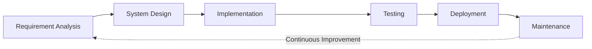

### SDLC Phases

| Phase                | Project Activity                                       |
| -------------------- | ------------------------------------------------------ |
| Requirement Analysis | Identify researcher problems and requirements          |
| System Design        | Design architecture, database and UML diagrams         |
| Implementation       | Develop frontend, backend and recommendation engine    |
| Testing              | Test search, authentication and recommendation modules |
| Deployment           | Deploy the web application                             |
| Maintenance          | Fix bugs, update APIs and improve ML model             |

---

# 📋 Software Process Model

## Agile Development Model

The project can be developed using the **Agile Software Development Model** because the recommendation engine and user interface can be developed incrementally.

### Proposed Agile Iterations

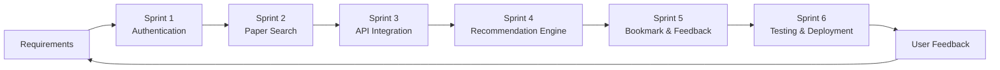

### Why Agile?

Agile allows the team to:

* Develop features incrementally.
* Receive feedback early.
* Modify requirements when necessary.
* Test individual modules continuously.
* Improve the recommendation model over multiple iterations.

---

# 🔍 Comparison of Software Process Models

| Model       | Characteristics                   | Applicability to Project                   |
| ----------- | --------------------------------- | ------------------------------------------ |
| Waterfall   | Sequential development            | Less flexible for changing AI requirements |
| Incremental | Product developed in increments   | Suitable for modular development           |
| Spiral      | Risk-driven iterative development | Useful for high-risk complex systems       |
| **Agile**   | Iterative and feedback-driven     | Suitable for this project                  |

---

# 🧪 Testing Strategy

The project will use different levels of software testing.

## Unit Testing

Individual components will be tested separately.

Examples:

* Login function
* Search function
* Recommendation calculation
* Feedback processing

## Integration Testing

Interaction between modules will be tested.

Examples:

```text
Frontend → Backend
Backend → Database
Backend → Academic API
Backend → Recommendation Engine
```

## System Testing

The complete application will be tested as a single system.

## User Acceptance Testing

The application will be tested by potential users such as students or researchers to determine whether the system satisfies the intended requirements.

---

# 🔐 Security Considerations

The system should follow basic software security practices:

* Password hashing
* Secure authentication
* Input validation
* API key protection
* Protection against unauthorized database access
* Secure API communication
* Session management

API credentials should **never be committed directly to GitHub**.

Use environment variables such as:

```env
API_KEY=your_api_key
DATABASE_URL=your_database_url
SECRET_KEY=your_secret_key
```

---

# 📖 Documentation & Standards

Proper documentation is maintained throughout the project.

Documentation includes:

* Problem Statement
* Objectives
* Functional Requirements
* Non-Functional Requirements
* System Architecture
* UML Diagrams
* Database Design
* Testing Documentation
* User Documentation
* Future Scope

Version control is maintained using **Git and GitHub**.

---

# 🧰 CASE Tools

CASE (**Computer-Aided Software Engineering**) tools can be used during the project for:

* UML diagram creation
* Database design
* System modeling
* Documentation
* Version management
* Project planning

Possible tools include:

* Draw.io
* Lucidchart
* StarUML
* Visual Paradigm
* GitHub

---

# 📊 Feasibility Study

## Technical Feasibility

The project is technically feasible because required technologies such as Python, React, Scikit-learn, NLP libraries and academic APIs are available.

## Operational Feasibility

The system is designed for students, researchers and faculty and can be operated through a web browser.

## Economic Feasibility

The project can initially be developed using open-source technologies and free-tier services, reducing development costs.

## Schedule Feasibility

The system can be developed incrementally within an academic project timeline using Agile methodology.

---

# ⚖️ Professional Ethics & Responsibility

The system should follow responsible software engineering practices.

### Data Privacy

User information and activity data should be stored securely.

### Research Integrity

The system should recommend papers based on available metadata and algorithms without falsely claiming that a paper is scientifically superior.

### Transparency

Users should understand that recommendations are generated algorithmically and may not always be perfect.

### Copyright

The system should respect copyright restrictions and should not redistribute copyrighted full-text papers without permission.

### API Responsibility

External APIs should be used according to their terms, rate limits and usage policies.

### Bias

Recommendation algorithms may produce biased results depending on available data. The system should be designed to minimize unintended bias and provide users with control over their recommendations.

---

# 🌱 Impact

The proposed system can:

* Reduce literature-search time.
* Help students discover relevant research.
* Assist researchers in exploring related work.
* Improve awareness of existing research.
* Encourage interdisciplinary discovery.
* Reduce repeated manual searching.
* Provide a personalized research experience.

---

# 🚫 Project Scope

## In Scope

* Web-based research paper search
* User registration/login
* User research profile
* Paper recommendations
* NLP-based content analysis
* Content-based filtering
* Basic collaborative filtering
* External academic API integration
* Bookmarking
* Feedback
* Citation export
* Personalized dashboard

## Out of Scope

* Plagiarism detection
* Automatic research paper writing
* Paper paraphrasing
* Paid journal database access
* Native mobile application
* Automatic paper translation
* Peer-review management
* Research paper submission system

---

# 📈 Expected Outcome

The expected final product is a functional web application capable of:

1. Registering and authenticating users.
2. Maintaining user research interests.
3. Searching academic papers.
4. Fetching paper metadata.
5. Processing paper content using NLP.
6. Generating personalized recommendations.
7. Allowing users to bookmark papers.
8. Collecting user feedback.
9. Updating user preferences.
10. Exporting citation information.

---

# 🚀 Future Scope

The system can be extended with:

* Citation network analysis
* Graph-based recommendations
* Transformer-based embeddings
* Large Language Model integration
* Semantic search
* RAG-based research assistance
* Research trend analysis
* Author recommendation
* Research collaboration recommendations
* Personalized research alerts
* Mobile application
* Multi-language support
* Advanced recommendation models

---

# 📁 Proposed Project Structure

```text
AI-Research-Paper-Recommendation-System/
│
├── frontend/
│   ├── src/
│   ├── public/
│   └── package.json
│
├── backend/
│   ├── app.py
│   ├── routes/
│   ├── models/
│   ├── services/
│   └── requirements.txt
│
├── recommendation_engine/
│   ├── preprocessing.py
│   ├── feature_extraction.py
│   ├── recommender.py
│   └── model.py
│
├── database/
│   └── schema.sql
│
├── docs/
│   ├── requirements.md
│   ├── architecture.md
│   ├── uml/
│   └── testing.md
│
├── tests/
│   ├── test_auth.py
│   ├── test_search.py
│   └── test_recommendation.py
│
├── .env.example
├── .gitignore
├── README.md
└── LICENSE
```

---

# ⚙️ Installation & Setup

## 1. Clone Repository

```bash
git clone https://github.com/your-username/AI-Research-Paper-Recommendation-System.git
```

```bash
cd AI-Research-Paper-Recommendation-System
```

## 2. Create Python Virtual Environment

```bash
python -m venv venv
```

### Windows

```bash
venv\Scripts\activate
```

### Linux / macOS

```bash
source venv/bin/activate
```

## 3. Install Backend Dependencies

```bash
pip install -r backend/requirements.txt
```

## 4. Configure Environment Variables

Create a `.env` file:

```env
SECRET_KEY=your_secret_key
DATABASE_URL=your_database_url
ARXIV_API_KEY=your_api_key
SEMANTIC_SCHOLAR_API_KEY=your_api_key
```

> Never upload the `.env` file to GitHub.

## 5. Run Backend

```bash
python backend/app.py
```

## 6. Run Frontend

```bash
cd frontend
npm install
npm start
```

---

# 📌 Git Workflow

The project uses Git for version control.

Recommended workflow:

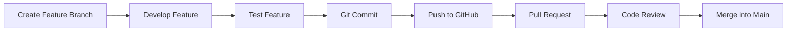

Example:

```bash
git checkout -b feature/recommendation-engine
```

```bash
git add .
git commit -m "Add recommendation engine"
```

```bash
git push origin feature/recommendation-engine
```

---

# 👨‍💻 Team Members

| S.No. | Name                  | Roll No. |
| ----: | --------------------- | -------: |
|     1 | **Saqib Khan**        |      224 |
|     2 | **Shakib Khan**       |      232 |
|     3 | **Shikhar Chaudhary** |      236 |
|     4 | **Shivanshu Gautam**  |      239 |

---

# 🎓 Academic Context

This project is developed as part of the **Software Engineering** course and demonstrates practical application of:

* Software Engineering principles
* Software Crisis and systematic development
* SDLC
* Agile methodology
* Requirement Engineering
* Software Design
* UML Modeling
* Database Design
* Software Testing
* Documentation
* CASE Tools
* Professional Ethics

---

# 📚 Learning Outcomes

Through this project, the team aims to gain practical experience in:

* Requirement analysis
* Software architecture
* UML modeling
* Agile project development
* Web application development
* Database management
* NLP and Machine Learning
* API integration
* Software testing
* Version control
* Technical documentation
* Professional software engineering practices

---

# 📜 License

This project is developed for **academic and educational purposes**.

A suitable open-source license can be added when the project is finalized.

---

# ⭐ Acknowledgement

The project makes use of open-source technologies and publicly available academic metadata sources. The respective APIs and platforms remain the property of their respective organizations.
## 👨‍💻 Contribution

- Shivanshu Gautam – Project documentation and development

---

## 🔖 Project Summary

**AI Research Paper Recommendation System** is an AI-powered academic search and recommendation platform that combines **Software Engineering, Web Development, NLP, Machine Learning, Database Management, and API Integration** to help users discover research papers relevant to their interests.

> **Search less. Discover more. Research smarter.**
